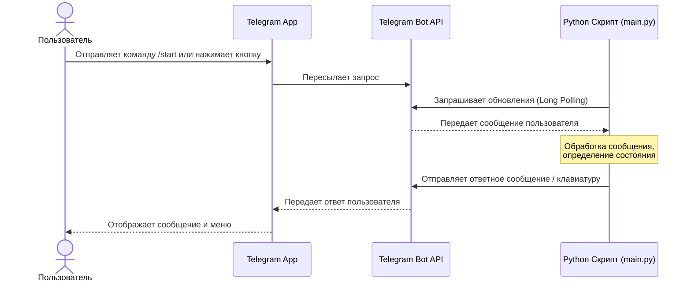
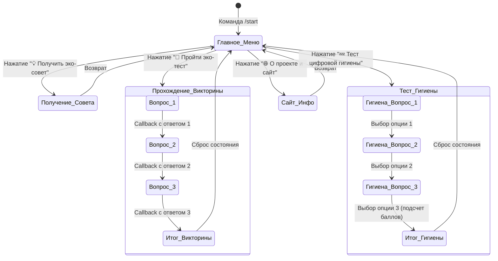
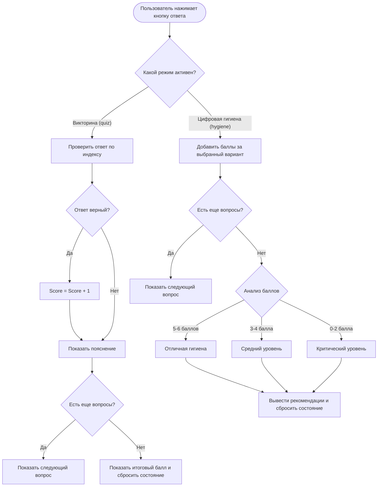

# Руководство по созданию Telegram-бота «ЭкоМедиа»
## Раздел: Вариативная часть (Практическая реализация технологии)

Данное руководство описывает процесс проектирования, разработки и развертывания Telegram-бота **«ЭкоМедиа»**, созданного в рамках вариативной части проектной (учебной) практики. Бот разработан на языке Python с использованием библиотеки `pyTelegramBotAPI`.

---

## 1. Исследование и проектирование

### Цель и идея бота
Основная идея бота — популяризация знаний в сфере **экологии человека**. Экология человека изучает взаимосвязь здоровья людей с окружающей средой (включая качество воды, содержание микропластика в быту) и цифровой средой (цифровая гигиена, влияние экранов на качество сна).

Бот предоставляет интерактивный интерфейс, позволяющий:
1. Пройти образовательную викторину (эко-тест) с мгновенной обратной связью.
2. Пройти тест цифровой гигиены с подсчетом баллов и выдачей персональных рекомендаций.
3. Получать случайные полезные эко-советы.
4. Быстро переходить на официальный сайт проекта.

### Архитектура системы
Бот работает по схеме Long Polling (бесконечный опрос сервера). Python-скрипт отправляет запросы к Telegram API, получает новые события (сообщения, нажатия кнопок) и обрабатывает их.

#### Диаграмма 1: Архитектура взаимодействия (Клиент-Сервер)



---

## 2. Диаграмма состояний бота (Finite State Machine - FSM)

Для отслеживания прогресса пользователя в тестах и викторинах используется менеджер состояний на базе словаря Python в оперативной памяти (`user_states`).

#### Диаграмма 2: Граф состояний пользователя в боте



---

## 3. Пошаговое руководство по созданию бота

### Шаг 1: Регистрация бота в Telegram
1. Откройте Telegram и найдите официального бота [@BotFather](https://t.me/BotFather).
2. Отправьте команду `/newbot`.
3. Задайте понятное имя бота (например, `ЭкоМедиа Бот`) и уникальный юзернейм, заканчивающийся на `bot` (например, `ecomediaprobot`).
4. Скопируйте полученный **API Token** (токен вида `8789087980:AAFa...`).

### Шаг 2: Настройка рабочего окружения
Для работы бота требуется установленный интерпретатор Python версии 3.8 или выше.

1. Установите библиотеку для работы с API:
   ```bash
   pip install pyTelegramBotAPI
   ```
2. Создайте файл `requirements.txt` в корне вашего проекта:
   ```text
   pyTelegramBotAPI==4.33.0
   ```

### Шаг 3: Написание кода бота
Создайте файл `src/main.py` и добавьте код. Ниже представлена логика инициализации и обработки меню.

#### Инициализация и главное меню:
```python
import telebot
from telebot import types
import random

TOKEN = "ВАШ_ТОКЕН_БОТА"
bot = telebot.TeleBot(TOKEN)

def get_main_keyboard():
    markup = types.ReplyKeyboardMarkup(resize_keyboard=True, row_width=2)
    btn_quiz = types.KeyboardButton("📝 Пройти эко-тест")
    btn_tips = types.KeyboardButton("💡 Получить эко-совет")
    btn_hygiene = types.KeyboardButton("💤 Тест цифровой гигиены")
    btn_site = types.KeyboardButton("🌐 О проекте и сайт")
    markup.add(btn_quiz, btn_tips, btn_hygiene, btn_site)
    return markup

@bot.message_handler(commands=['start', 'help'])
def send_welcome(message):
    welcome_text = (
        "👋 Приветствуем вас в ЭкоМедиа Боте!\n"
        "Бот разработан в рамках учебной практики.\n"
        "Используйте кнопки меню для взаимодействия!"
    )
    bot.send_message(message.chat.id, welcome_text, reply_markup=get_main_keyboard())
```

---

## 4. Логика интерактивных тестов и викторин

Для реализации викторины используются встроенные inline-клавиатуры (`InlineKeyboardMarkup`), которые не забивают чат новыми сообщениями, а обновляют текущие данные.

#### Диаграмма 3: Алгоритм обработки ответов на тесты (Блок-схема)



### Код обработки inline-кнопок викторины:
```python
@bot.callback_query_handler(func=lambda call: True)
def handle_callback(call):
    chat_id = call.message.chat.id
    state = user_states.get(chat_id, {})
    
    if call.data.startswith("quiz_") and state.get("mode") == "quiz":
        ans_idx = int(call.data.split("_")[1])
        q_idx = state["current_question"]
        q_data = QUIZ_QUESTIONS[q_idx]
        
        # Удаляем инлайн-кнопки после нажатия
        bot.edit_message_reply_markup(chat_id, call.message.message_id, reply_markup=None)
        
        if ans_idx == q_data["correct"]:
            state["score"] += 1
            bot.send_message(chat_id, "✅ Правильно!")
        else:
            bot.send_message(chat_id, f"❌ Неверно. Правильно: {q_data['options'][q_data['correct']]}")
            
        # Переход к следующему вопросу
        state["current_question"] += 1
        send_quiz_question(chat_id)
```

---

## 5. Запуск и развертывание бота

1. Убедитесь, что все зависимости установлены:
   ```bash
   pip install -r requirements.txt
   ```
2. Запустите скрипт:
   ```bash
   python src/main.py
   ```
3. Для обеспечения круглосуточной работы бота (24/7) его рекомендуется разворачивать на виртуальном сервере (VPS/VDS) под управлением Linux с использованием менеджера процессов `systemd` или контейнеризации `Docker`.
